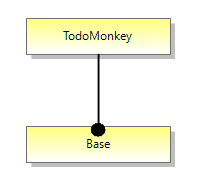
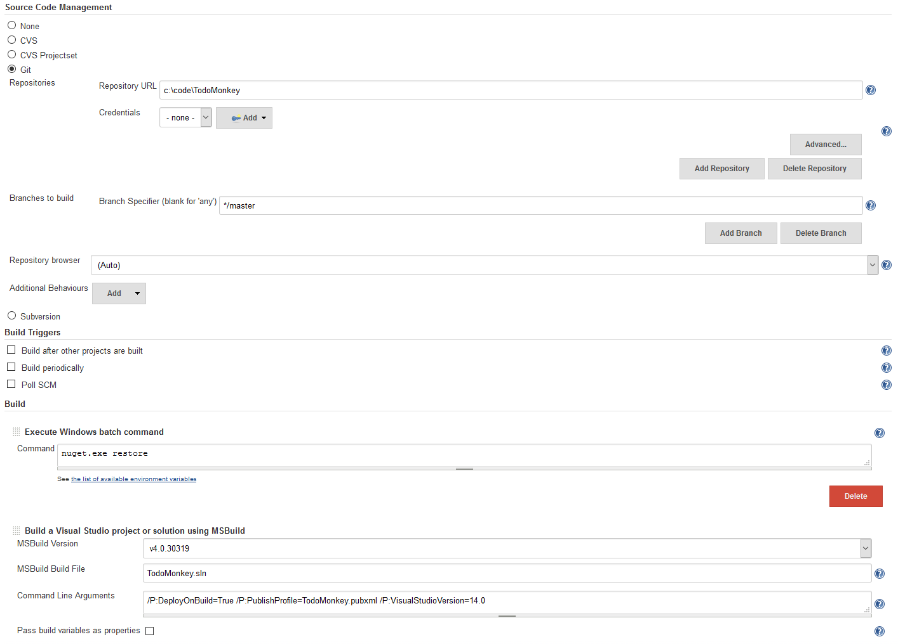
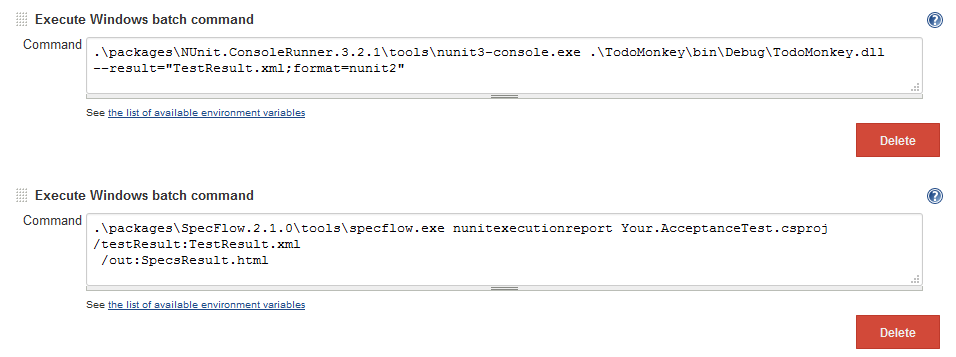
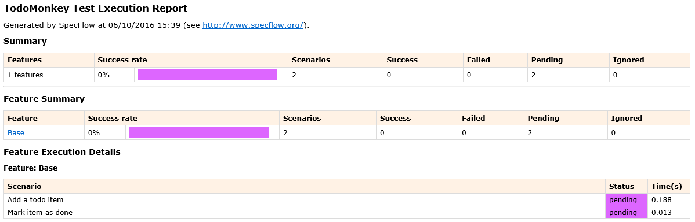

**************
Worked Example
**************

This section will show a worked example of creating and evolving
a software product line using ApleT.  This will go through all of
the steps within the :ref:`ApleT process <aplet-process>`, using the tools from the 
:ref:`.NET ApleT toolchain <dotnet-aplet>`.

We will work through a very simple web app product line, the 
`TodoMonkey product line <http://featuremonkey_js.schnapptack.de/latest/example_spl/>`_ 
for todo list applications as introduced by `Schnapptack <http://schnapptack.de/>`_.

The TodoMonkey product line
===========================

The feature model of the full TodoMonkey Product Line looks like this:

.. image:: _static/todomonkey-featuremodel.png

.. todo:: This feature model might need some refining, e.g. break base into list, add item, label, mark as done, etc

Feature base is mandatory (filled circle). All other features are optional(empty circle). However, feature search depends on feature filter.

base   
    provides a basic todo list. Items can be added. Items have a label and can be marked as done.

description    
    adds a description field to each item. Double click items so see the field.

filter     
    adds filter functionality: show all, show done, show not done.

search     
    adds a search field (searches all the labels).

In this example, we will add a bit of history to the TodoMonkey product line, and show how it could
have evolved over time.

The process
===========

Feature model
-------------

First we will create a feature model.  To begin with, we are making this for just one customer,
and they only want the most simple, base implementation.  The feature model is created and amended
by the :ref:`Feature Modeller <aplet-roles>` using the Feature Modelling Tool.  In this case, that's
us, and we'll use the Feature Model DSL Visual Studio extension.

Product configuration
---------------------

Customer A wants all the features.  After all, that's why we're building the product.
Let's make a configuration for Customer A.

Specifications
--------------

Let's make a specification for the Base feature.
We'll put it in a folder called `Specifications` for now.

.. code-block:: gherkin

    Feature: Base
        In order to keep track of things I need to do
        As a Todo Monkey
        I want to be able to maintain a list of todo items

    Scenario: Add a todo item
        When I create a new todo item named 'Buy milk'
        Then the new todo item should be in my todolist

    Scenario: Mark item as done
        Given I have the following todolist:
            | Todo     |
            | Buy milk |
        When I mark the 'Buy milk' item as done
        Then the 'Buy milk' todo should be recorded as done in my list

.. code-block:: gherkin

    Feature: Add Todo

        In order to keep track of the things I need to do
        As a TodoMonkey
        I want to add todo items to a todolist

    Scenario: User adds valid todo
        Given the user has input the label 'Take over the world'
        When the user submits the todo
        Then the todo should be added to the user's todolist

    Scenario: User adds invalid todo
        Given the user has left the label blank
        When the user submits the todo
        Then the user should prompted to add a label

Build a product and get it tested
---------------------------------

.. todo:: talk about jenkins config, e.g. we need git and msbuild plugins
.. todo:: need to reference the GOOS book more for walking skeleton, outside in ideas, etc.

Now we need to add a build configuration to our continuous integration setup,
that will 'continuously' build the product for Customer A and run the specification
tests against it so we and the product owner can see how much we have done.

See `walking skeleton <https://gojko.net/2014/06/09/forget-the-walking-skeleton-put-it-on-crutches/>`_.

So first of all we need a new build profile in Jenkins.

We also need a very naive product implementation.  Something that we can run the specification tests against.

We'll create a basic web app.

We also need to create a build script that Jenkins can run and produce and deploy our naive product, in
order to run tests on it.

The script could be some combination of Jenkins' own build steps, and calling out to a build scripting language
such as FAKE.

.. todo:: write the test execution code, here probably use browser automation

.. code-block:: csharp

    [Given("the user has input the label '(.*)'")] 
    public void GivenTheUserHasInputTheLabel(string label) 
    { 
        ScenarioContext.Current.Set(label, "TodoLabel"); 
    } 
     
    [When("the user submits the todo")] 
    public void WhenTheUserSubmitsTheTodo() 
    { 
        var label = ScenarioContext.Current.Get("TodoLabel"); 
     
        var result = todoService.AddTodo(label); 
    } 
      
    [Then("the todo should be added to the user's todolist")] 
    public void ThenTheTodoShouldBeAddedToTheUsersTodolist() 
    { 
        result.ActionSuccessful.Should().BeTrue(); 
    } 

Progress report
---------------

.. todo:: discuss manual vs automated build runs in jenkins

We are now able to run the build within Jenkins, which produces a progress report for us.

As we can see, the status of the specification tests is 'pending' - we haven't written
any test layer code yet.

Writing the test layer code
---------------------------

We want to write the test layer code that tests our production system.

We have a lot of freedom in how we write this test code -- it could be full 
end-to-end tests, where we exercise the entire system from the interface by
automation, or it could be a lower level integration test that might avoid
the interface.  Interface automation has its benefits and its pitfalls --
one main benefit being we know we are exercising the system as a user would.
However if not carefully written, automation tests can be brittle.  And they
can be slow to execute, which leads to issues of scale.

.. todo:: more discussion of automation testing vs lower level

We're going to write tests that bypass the interface for now.
We're going to test our first scenario.

.. code-block:: gherkin

    When I create a new todo item named 'Buy milk'
    Then the new todo item should be in my todolist

