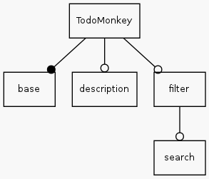

**************
Worked Example
**************

This section will show a worked example of creating and evolving
a software product line using ApleT.  This will go through all of
the steps within the :ref:`ApleT process <aplet-process>`, using the tools from the 
:ref:`.NET ApleT toolchain <dotnet-aplet>`.

We will work through a very simple web app product line, the 
`TodoMonkey product line <http://featuremonkey_js.schnapptack.de/latest/example_spl/>`_ 
for todo list applications as introduced by `Schnapptack <http://schnapptack.de/>`_.

The product line
================

The feature model of the full TodoMonkey Product Line looks like this:

Feature base is mandatory (filled circle). All other features are optional(empty circle). However, feature search depends on feature filter.
Description of individual features

base   
    provides a basic todo list. Items can be added. Items have a label and can be marked as done.

description    
    adds a description field to each item. Double click items so see the field.

filter     
    adds filter functionality: show all, show done, show not done.

search     
    adds a search field (searches all the labels).

In this example, we will add a bit of history to the TodoMonkey product line, and show how it could
have evolved over time.

The process
===========

First we will create a feature model.  To begin with, we are making this for just one customer,
and they only want the most simple, base implementation.

.. todo:: image of feature model with just base

We will start the process by building a `walking skeleton <https://gojko.net/2014/06/09/forget-the-walking-skeleton-put-it-on-crutches/>`_
for our application.

