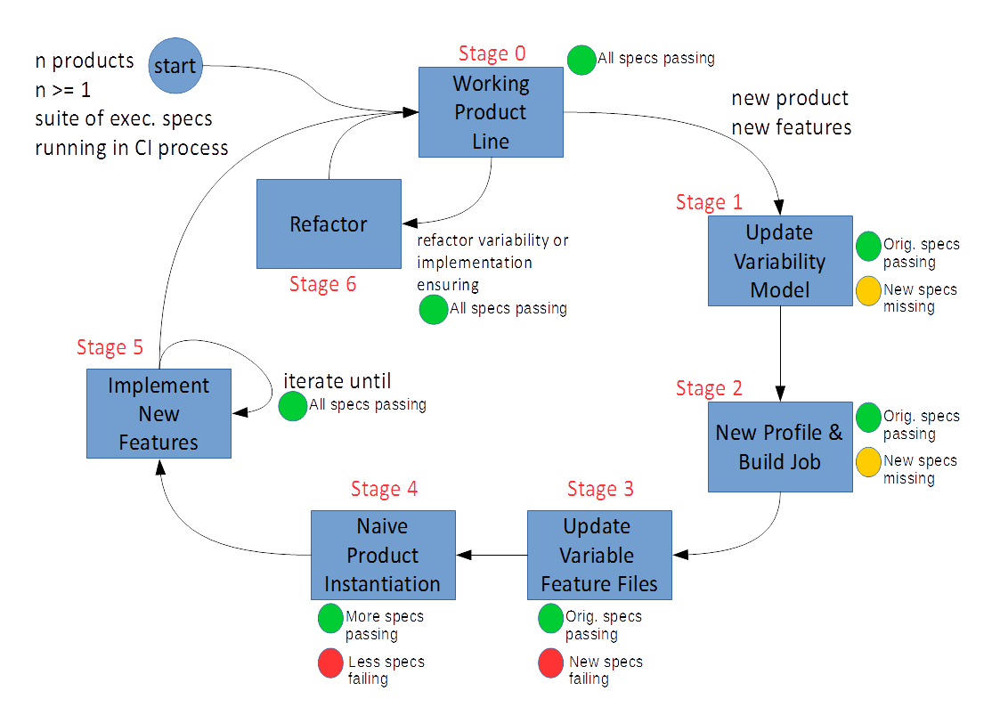
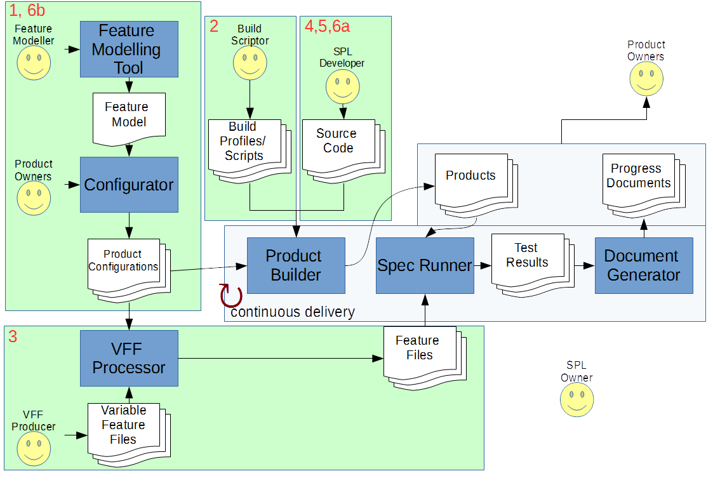

.. _aplet-process:

The ApleT Process
=================

The ApleT framework includes a process that should be followed during the
production or maintenance of products in the product line. The trigger for a
new cycle through the evolution process is a change in requirements -- this is
either through the development of the software for a new customer, or the
amendment of the software for an existing customer.

0. *Entry Point*. The entry point to the process is a suite of products that are
   covered by executable specifications (variability-enabled or not.) Each
   product has a variability profile and a build configuration, and the
   executable specifications are run as part of a continuous build system
   process that consistently outputs deployable software. 

1. *Variability Evolution*. When new variability is required, whether by a new
   product in the product line or a new feature for one or more products in the
   product line, requirements are gathered and the variability model is
   generalised. This is captured in the FeatureIDE modelling tool.

2. *New Variability Profile and Build Configuration*. New variability profiles
   are produced. In the case of a new product, a new variability profile is
   produced for the whole product, and a new build configuration is introduced
   for the build system. The variability profile is created in the FeatureIDE
   modelling tool, and the job build configuration is constructed in Jenkins
   and FAKE.

3. *Naive Product Instantiation*. A naive product instantiation is enabled in the
   product line implementation, which using the new profile and build
   configuration the build system can build, deploy and run executable
   specifications against. This naive product instantiation may be a complete
   source clone, or hopefully it will be a case of configuring a more advanced
   product line implementation.

4. *Implement new variability*. For any new variants introduced, BDD
   specifications are generated and implemented that encompass the new
   variability. This is done iteratively, feature by feature.

        a. Create (Failing) Executable Specification. For the new variant,
        create a new executable specification.

        b. Implement specification. Dropping down into the low-level red-green
        refactor cycle until the specification acceptance test is passing.

        c. Repeat for all new variability.

5. *Refactor*. When all specifications are passing for all products, refactor the
   product line implementation.

6. *Repeat*.

Throughout this cycle, test reports are generated by the build system process
to provide feedback on the state of all products in the product line.

.. todo:: fit the ApleT process into the different quadrants defined in :ref:`sple process <sple-process>`

