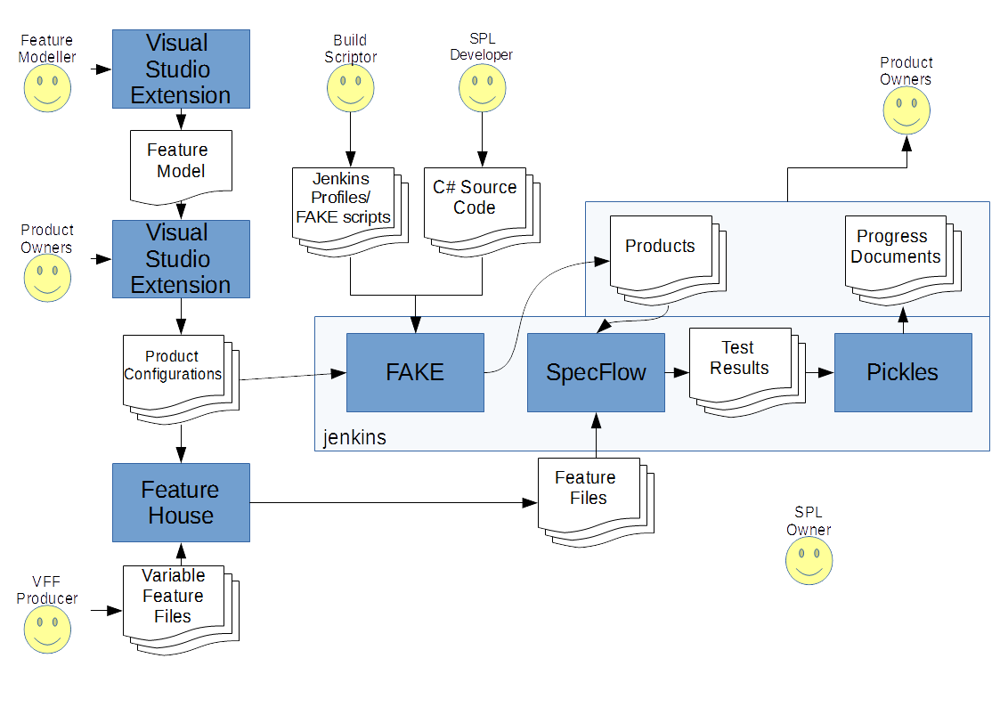

.. _aplet-toolchain:

*******************
The ApleT Toolchain
*******************

The ApleT process defines a number of tools that are required.

These are as follows:

* Feature Modelling Tool.
  Used to produce feature models.

* Product Configurator.
  Used to configure instances of products for individual customers.

* Feature File Composer.
  Used to compose together variable Gherkin feature files into specific
  versions for each configured product.

* CI Server.
  Used to build, test and deliver products and reports.

* Product Builder.
  Used to build products as part of a continuous integration process.

* Spec Runner.
  Used to run the specification tests for the products.

* Report Generator.
  Used to produce real-time progress reports that provide feedback
  on the status of product feature implementations.

The idea is that the ApleT process should be reusable across different
development stacks, be it .NET, Java, Ruby, Python, Node, or some 
combination of these.

Reference implementation of ApleT in .NET
=========================================

* Feature Modelling Tool = Feature Model DSL.
* Product Configurator = Feature Model DSL.
* Feature File Composer = FeatureHouse.
* Product Builder = FAKE.
* CI Server = Jenkins.
* Spec Runner = SpecFlow.
* Report Generator = Pickles.

Example Java toolchain for ApleT
================================

